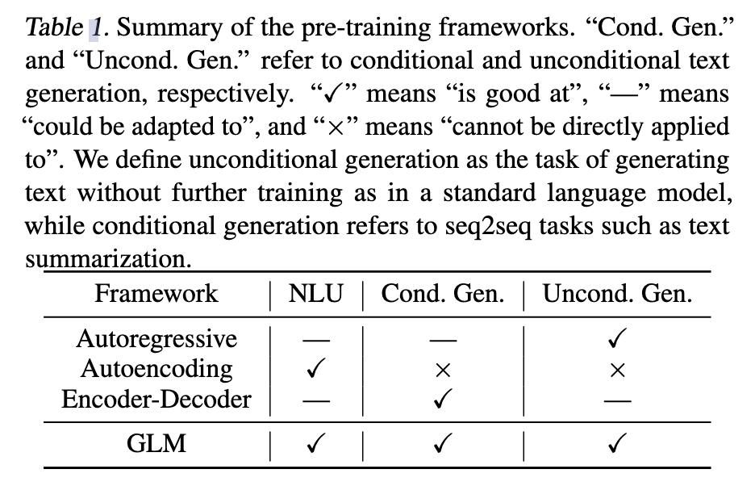
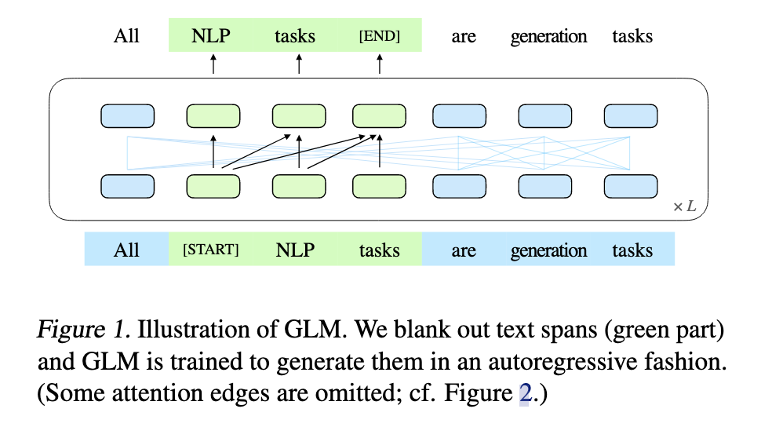
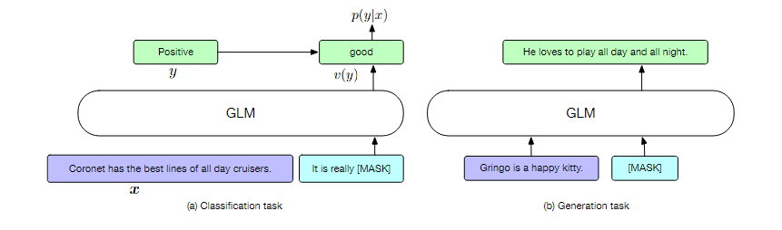
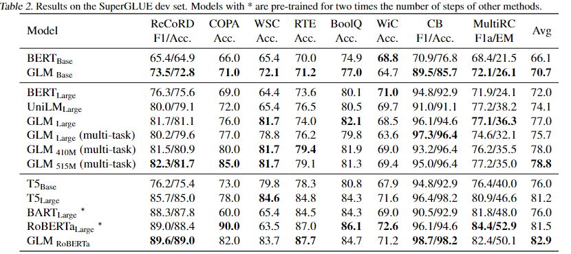
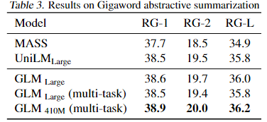
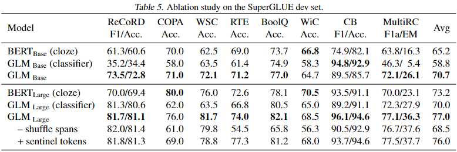

# 【WhalePaper】第13期 All NLP Tasks are Generation Tasks
## 1. 背景介绍 
诸多自然语言处理（NLP）任务本质上是不同的，主要分为三大类：（clsssification）、无条件生成（unconditional generation）和有条件生成（conditional generation）。截止此文时，预训练架构有三种主要类型，包括自回归模型（autoregressive models, 如GPT，2018a）、自编码模型（autoencoding models, 如BERT，2019）和编码-解码模型（encoder-decoder models, 如T5）。然而没有任何一种预训练框架能够在所有类型的任务中都实现最佳的表现效果，这给模型的开发和选择带来了不便。



1. 自回归模型，学习从左到右的语言模型。虽然它们在生成长文本方面取得了成功，并且在参数规模扩展到数十亿时展现出了强大的少样本学习能力（Radford等，2018b；Brown等，2020），但其固有的劣势在于单向注意机制无法充分捕捉上下文标记之间的交互。（擅长无条件生成任务，能够做自然语言理解和条件生成的任务）
  
2. 自编码模型，通过去噪目标学习双向Transformer作为上下文编码器。这些编码器生成的上下文表示在自然语言理解任务方面表现出色，但不能直接应用于文本生成。（擅长自然语言理解任务，无法应用于条件生成和无条件生成的任务）
  
3. 编码-解码模型在编码器模型中采用双向注意，解码器模型中采用单向注意，通过交叉注意力将它们连接起来（Song等，2019；Bi等，2020）。它们通常用于条件文本生成任务，如文本摘要和回复生成。（擅长条件生成任务，能够应用于自然语言理解和无条件生成的任务）

4. GLM（General Language Model, 通用语言模型）：三种任务都很擅长。

**预训练语言模型** 在自然语言处理领域中，自监督学习长期以来被用于学习词向量作为神经网络的输入(Mikolov等人，2013; Pennington等人，2014)。最近，在丰富的网络文本上使用自监督学习来预训练大规模语言模型显著提高了下游任务的性能。有三种类型的预训练语言模型。第一种类型是自编码模型，它学习一个上下文编码器通过去噪目标来实现自然语言理解。BERT(Devlin等人，2019)通过掩码语言建模来预训练大型Transformer模型(Vaswani等人，2017)以获取上下文的词表示。SpanBERT(Joshi等人，2020)对连续跨度的令牌进行掩码，以改善跨度表示。第二种类型是自回归模型，它学习了一个从左到右的语言模型来进行文本生成。GPT(Radford等人，2018a)表明，通过生成式预训练学习到的表示也可以提高语言理解。XLNet(Yang等人，2019)通过排列语言建模来概括自回归模型，以学习语言理解任务的双向注意力。第三种类型是为seq2seq任务预训练的编码器-解码器模型。MASS(Song等人，2019)将包含连续掩码片段的输入文本映射到掩码令牌。BART(Lewis等人，2019)应用各种转换，包括掩码、删除和排列，并使用解码器恢复原始文本。PALM(Bi等人，2020)预训练用于从给定上下文生成连贯文本，并向编码器添加了基于BERT的自编码目标。

**作为生成任务的NLU** 之前，预训练语言模型使用学到表示的线性分类器来完成自然语言理解的分类任务。GPT-2 (Radford等人，2018b)表明，生成式语言模型可以通过直接预测正确答案来学习完成理解任务，例如问题回答和阅读理解，甚至不需要任何明确的监督。GPT-3 (Brown等人，2020)进一步证明了语言模型可以在少样本学习的情况下，在上下文中添加一些标记示例后，在NLU任务上取得强大的性能。但由于单向注意力的限制，生成模型需要更多的参数才能工作。T5 (Raffel等人，2020)将大多数语言任务都制定为文本到文本的框架，但需要更多的参数才能胜过基于BERT的模型，如RoBERTa (Liu等人，2019)。

最近，PET (Schick & Sch ̈utze, 2020b;a)提出了在少样本学习设置中将输入示例重新制定为具有与预训练语料库相似模式的填空问题。研究表明，结合ALBERT上的梯度微调，PET在少样本学习设置下可以比GPT-3取得更好的性能，而只需其0.1%的参数。Athiwaratkun等人 (2020); Paolini等人 (2021)提出了用于结构化预测任务的增强自然语言，如序列标记和关系提取。Donahue等人 (2020)和Shen等人 (2020)也研究了空白填充语言模型。与他们的工作不同，GLM通过空白填充预训练语言模型，并在下游NLU和生成任务中评估其性能。


## 2. 动机 

以前的研究尝试通过多任务学习将不同框架的目标结合起来（Dong等，2019；Bao等，2020）。然而，自编码和自回归目标在本质上是不同的，简单的结合无法充分继承两种框架的优势。

本文提出了一种基于自回归填空的新型预训练方法，称为GLM。遵循自编码的思想，从输入文本中随机留出连续的标记段落，然后遵循自回归预训练的思想，训练模型重构这些标记段落。为了在单一框架中同时学习双向和单向注意机制，GLM将输入文本分为两部分，其中未屏蔽的令牌可以相互关注，但屏蔽的令牌不能关注后续的屏蔽令牌。同时提出了一种二维位置编码技术，用于表示跨段和段内的位置信息。下图表明了预训练目标。GLM在预训练期间同时学习了上下文表示和自回归生成。



当在下游任务上微调模型时，将它们重新定义为空白填空生成（受到了Schick＆Schütze，2020a;b的启发）。每个任务都与一个人工设计的填空问题相关联，模型会预测完型填空的答案。例如，情感分类任务被重新定义为填空问题"【前文】真的很__"。对空白填写"好"或"坏"的预测来表示情感是积极的还是消极的。通过这种表述，GLM从预训练和微调之间的一致性中受益，因为预训练和微调都涉及训练模型根据上下文生成文本。最终，与类似BERT的模型相比，GLM更适用于下游的分类任务。为了更适合文本生成任务，本文提出了一个多任务预训练设置，其中模型经过联合训练以重建被屏蔽的段落并生成更长的文本。

实证上，本文展示了在相同的预训练数据和接近的计算成本下，GLM在SuperGLUE自然语言理解基准测试上显著优于BERT，大幅领先4.6% - 5.0%。当在相同的更大语料库（158GB）上进行预训练时，GLM也优于RoBERTa、T5和BART。此外，与独立的基准模型相比，采用多任务预训练的GLM在理解、条件生成和语言建模任务中都可以在共享参数的情况下取得提升。

## 3. 模型架构、方法 

### 3.1. 模型架构

GLM使用类似于BERT（Devlin等，2019）的Transformer架构。首先，输入标记$[x_1,x_2,\ldots,x_n]$通过可学习的嵌入表被投影为嵌入向量$\mathbf{H}^0 = [h^0_1, h^0_2,\ldots,h^0_n]$。然后，应用$L$个Transformer层来计算令牌的隐藏状态。每个层包括一个多头自注意层和一个位置逐点的全连接前馈网络。具体来说，第$l$层中的自注意头定义如下：
```math
Q^l = H^l W^l _Q, \quad K^l = H^l W^l _K, \quad V^l = H^lW^l_V
```
```math
A^l = \text{softmax}(\frac{Q^l(K^l)^T}{\sqrt{d_k}} + M)V^l \quad \quad (1)
```
其中$\mathbf{W}^l_Q,\mathbf{W}^l_K,\mathbf{W}^l_V \in \mathbb{R}^{d_h \times d_k}$是模型参数。$\mathbf{M} \in \mathbb{R}^{n \times n}$是自注意掩码的矩阵，$M_{ij} = 0$表示标记$x_i$被允许关注标记$x_j$，而$M_{ij} = -\infty$则表示阻止。

在遵循Megatron-LM（Shoeybi等，2019）的基础上，GLM对BERT架构进行了两个修改：（1）重新排列了层归一化和残差连接的顺序，这在模型扩展到大型BERT风格时已被证明是至关重要的。（2）将用于令牌预测的前馈网络替换为线性层，因此输出位置$i$被定义为：
```math
p_i = \text{softmax}(h^L_iW_{o}) \quad \quad (2)
```
其中$W_{o} \in \mathbb{R}^{d_h \times |V|}$，而$|V|$是词汇表的大小。

### 3.2. 自回归空白填充任务

GLM通过优化自回归的空白填充任务进行训练。给定输入文本$x=[x_1,\ldots,x_n]$，随机采样多个文本片段$\{s_1,\ldots,s_m\}$，其中每个片段$s_i$对应于输入文本$x$中的一系列连续令牌$[s_{i,1}, \ldots, s_{i,l_i}]$。文本片段的数量和长度取决于预训练目标（详见第3.3）。每个片段都被替换为单个[MASK]令牌，形成损坏的文本$x_{\text{coorupt}}$。模型以自回归方式从损坏的文本中预测片段中缺失的令牌，这意味着在预测片段中的缺失令牌时，模型可以访问设定为损坏的文本和先前预测的片段。为了充分捕捉不同片段之间的相互依赖关系，我们随机排列片段的顺序，类似于（Yang等人，2019）。形式上，令$Z_m$表示长度为m的索引序列$[1,2,\dots,m]$的所有可能排列集合，$s_{z_{<i}}$表示$[s_{z_1},\dots,s_{z_{i-1}}]$，我们将预训练目标定义为
```math
\max\limits_{\theta} \mathbb{E}_{z \sim Z_m} \left[ \sum\limits_{i=1}^m \log p_{\theta}(s_{z_i} | x_{\text{corrupt}}, s_{z_{<i}}) \right] （3）
```
这个任务与SpanBERT（Joshi等人，2020）的任务不同，因为一个片段中缺失的令牌数量对模型而言是未知的。此外，GLM也是以自回归方式预测缺失的令牌。我们总是按从左到右的顺序生成每个空白处的令牌，也就是说，生成片段$s_i$的概率被分解为：
```math
p_\theta (s_i | x_{\text{corrupt}}, s_{z_{< i}}) = \prod\limits_{j=1}^{l_i} p(s_{i,j} | x_{\text{corrupt}}, s_{z_{ < i}}) \quad\quad (4)
```
具体来说，我们通过以下技巧实现了自回归的空白填充任务。输入令牌被分为两部分。部分A包括损坏的文本$x_{\text{corrupt}}$，其中采样的文本片段被替换为[MASK]令牌。部分B包括被屏蔽的片段中的令牌。部分A中的令牌可以关注A中的所有令牌，但不能关注B中的任何令牌。部分B中的令牌可以关注A中的令牌以及B中的先前令牌，但不能关注B中的后续位置。类似于原始Transformer模型中的解码器，每个片段中的令牌在开头和结尾分别填充了两个特殊令牌[START]和[END]。通过这种方式，我们的模型在一个单一的模型中自动学习了双向编码器（部分A）和单向解码器（部分B）。整个实现如图2所示。


图2. GLM预训练框架。
(a) 原始文本是 $[x_1, x_2, x_3, x_4, x_5, x_6]$ ，采样了两个片段 $[x_3]$ 和 $[x_5, x_6]$。
(b) 将采样的片段替换为 [MASK] 令牌以形成部分A，并对采样的片段进行重排以形成部分B。
(c) GLM被训练以自回归生成部分B。每个片段都以 [START] 令牌作为输入的前缀，并以 [END] 令牌作为输出的后缀。二维位置编码用于表示片段之间和片段内部的位置关系。
(d) 自注意力掩码控制着注意机制，灰色区域被屏蔽。部分A的令牌可以关注A（蓝框区域），但不能关注B。部分B的令牌可以关注A以及它们在B中的前导令牌（黄框和绿框区域表示部分B中的两个跨度可以关注的令牌）。 [M]，[S] 和 [E] 分别代表 [MASK]，[START] 和 [END]。

#### 3.2.1. 二维位置编码

上述任务中的挑战之一是如何编码位置信息。Transformer依赖添加到输入嵌入中的位置编码，用以注入令牌的绝对和相对位置。作为类似的自回归模型，XLNet（Yang等人，2019）对部分A和部分B中的令牌编码了原始位置。因此，模型能够感知一个片段中缺失的标记数量。

本文提出了一种新颖的二维位置编码来应对这一挑战。具体地，每个令牌都用两个位置ID进行编码。第一个位置ID表示在损坏的文本$x_{\text{coorupt}}$中的位置。对于部分B中的令牌，它就是相对应的[MASK]令牌的位置。第二个位置ID表示片段内部的位置。对于部分A中的令牌，第二个位置ID为0。对于部分B中的令牌，它的取值范围从1到该片段的长度。这两个位置ID通过两个独立的嵌入表投影成两个位置向量，并添加到输入嵌入中。

### 3.3. 预训练目标
正如在第2.2节中所述，GLM的预训练目标被定义为对被屏蔽的片段进行自回归生成。与BERT类似，被屏蔽的部分占原始令牌总数的15%。根据经验，我们发现这个比例对于在下游自然语言理解任务上获得良好的性能至关重要。根据BART（Lewis等人，2019）的方法，这些片段的长度是从泊松分布中抽取的，其中$λ = 3$。我们反复抽取新的片段，直到超过15%的原始令牌被屏蔽。

与其他BERT风格的模型类似，GLM会屏蔽短片段并且适合自然语言理解任务（NLU）。然而，我们是对预训练一个可以同时处理NLU和文本生成任务的单一模型感兴趣。我们进一步研究了一种多任务预训练设置，其中生成较长文本的第二个目标与GLM一起进行优化。具体而言，我们抽样一个单独的涵盖原始标记的50%至100%的片段。片段的长度是从均匀分布中取样的。新的目标与原始目标的定义方式相同。唯一的区别是只有一个但要长得多的片段。

### 3.4. 微调GLM

以前，对于下游自然语言理解任务，线性分类器将预训练模型生成的表示作为输入，并预测正确答案。对于令牌分类任务，输入是目标令牌的表示。对于序列分类任务，输入是[CLS]令牌的表示，[CLS]令牌用来表示序列。这些做法与完形填空的预训练任务不同，导致了预训练和微调之间的不一致性。


相反，我们将自然语言理解中的分类任务制定为空白填充的生成任务，遵循PET（Schick＆Sch ̈utze，2020b）。形式上，给定一个标记的示例$(x, y)$，我们通过包含单个屏蔽令牌[MASK]的模式将输入文本$x$映射到一个填充问题$c(x)$上。该模式应当类似于预训练数据集中的自然语言。例如，在情感分类任务中，文本可以被制定为"[SENTENCE]. It's really [MASK]"。标签$y$也被映射到填充的答案上，称为言语表达器$v(y)$。在情感分类任务中，标签"积极的"或"消极的"被映射到填充中的单词"好"或"坏"。句子为正面或负面的概率与对填空预测为"好"或"坏"的概率成正比。因此，给定$x$的条件概率$y$是这样的：
```math
p(y|x) = \frac{p(v(y)|c(x))}{\sum_{y'\in \mathcal{Y}} p(v(y')|c(x))}
```
在这种情况下，$\mathcal{Y}$代表标签集合。然后，我们可以使用交叉熵损失来对GLM进行微调。

GLM在这种情况下特别适用，原因有两点。首先，GLM可以自然地处理填充未知长度的空白。BERT风格的模型必须通过[MASK]令牌的数量或位置编码来了解缺失令牌的数量。其次，GLM打破了BERT对被屏蔽令牌之间独立性的假设，因此能够捕捉更多的依赖关系。

对于文本生成任务，我们直接将GLM应用为自回归模型。给定的上下文构成输入的第一部分A，末尾有一个[MASK]标记。然后，GLM自回归生成第二部分B的文本。我们可以直接应用预训练的GLM进行无条件生成，或者在下游条件生成任务上对GLM进行微调。微调框架如图3所示。



图3. GLM微调框架。
(a) 将情感分类任务制定为使用GLM进行填空填充的任务。
(b) 给定上下文的情况下GLM用于文本生成。这可以是零样本设置下的语言建模，或带微调的seq2seq模型。


## 4. 实验分析

在本节中，描述了GLM在两种不同设置下的实验。在第一种设置中，使用单一的BERT风格目标来预训练GLM，并将其与BERT类似的模型在自然语言理解任务上进行比较。展示了结合新型分类任务制定方式的自回归填空预训练，能够在性能上优于微调后的使用线性分类器的双向编码器。在第二种设置中，同时使用BERT风格目标和生成目标来预训练GLM。展示了GLM可以有效地共享不同任务的模型参数。

### 4.1. 预训练数据和实现
在实验中，遵循BERT（Devlin等人，2019）的做法，使用BooksCorpus（Zhu等人，2015）和英文维基百科作为预训练数据。使用与BERT相同的30k词汇量的Word-piece分词器。每个输入文本都是从语料库中采样的文档，文档开头加上一个序列开始令牌[SOS]，文档末尾加上一个序列结束令牌[EOS]。如果文档长度超过了Transformer模型的最大序列长度，会随机采样一个连续的最大长度的段落。

对于单一目标的预训练，训练了一个$GLM_{Base}$和一个$GLM_{Large}$，它们的架构与$BERT_{Base}$和$BERT_{Large}$相同，分别具有110M和340M个参数。对于多目标的预训练，额外训练了两个GLM模型，分别具有410M（30层，隐藏大小1024，16个注意力头）和515M（30层，隐藏大小1152，18个注意力头）个参数。softmax预测的输出矩阵与输入嵌入矩阵绑定在一起。最大序列长度设置为512。

使用AdamW优化器（Loshchilov＆Hutter，2019），设置$β_1 = 0.9，β_2 = 0.98，ε = 1e-6$。采用线性学习率预热，在前8000个步骤内逐渐增加学习率，然后采用余弦衰减。$GLM_{Base}$的峰值学习率设置为4e-4，$GLM_{Large}$为2e-4。权重衰减率为0.1，丢失率为0.1。在64个Nvidia V100 GPU上训练GLM，共进行200,000个步骤，批量大小为1024，耗时约2.5天。

为了与SOTA预训练语言模型进行比较，文章还使用RoBERTa（Liu等人，2019）的数据、分词和超参数来训练一个$GLM_{Large}$模型，标记为$GLM_{RoBERTa}$。RoBERTa使用的故事数据集（Trinh＆Le，2019）已不再可用。因此，用OpenWebText2（66GB）替代OpenWebText（38GB）（Gokaslan＆Cohen，2019）。整个数据集总共有158GB的未压缩文本，接近RoBERTa的160GB数据集的大小。由于资源限制，文中只对模型进行了250,000个步骤的预训练，这是RoBERTa和BART的训练步骤的一半，接近T5的训练令牌数。其他超参数与$RoBERTa_{Large}$相同。

### 4.2. SuperGLUE
为了评估预训练的GLM模型，在SuperGLUE（Wang等人，2019）基准上进行了实验。SuperGLUE包括8个具有挑战性的自然语言理解任务，包括问答（Clark等人，2019; Khashabi等人，2018; Zhang等人，2018）、文本蕴含（Dagan等人，2005; Clark等人，2019）、共指消解（Levesque等人，2012）、词义消歧（Pilehvar＆Camacho-Collados，2019）和因果推理（Roemmele等人，2011）。本文采用了与（Wang等人，2019）相同的评估指标。

文章将每个任务重新制定为空白填充任务，使用PET（Schick＆Schütze，2020a）构建的模式来构造人工制作的填空问题。然后，根据第3.4节中的描述，对每个任务对预训练的GLM模型进行微调。对于微调，文中还使用了AdamW优化器，峰值学习率为1e-5，在前6%的训练步骤内进行预热，然后进行线性衰减。对于小型数据集（COPA、WSC、CB、RTE），本文对GLM进行20个epoch的微调。对于较大的数据集，由于模型更早地收敛，故而减少了训练epoch的数量（WiC、BoolQ、MultiRC为10个epoch；ReCoRD为5个epoch）。

为了与$GLM_{Base}$和$GLM_{Large}$进行公平比较，文章选择了$BERT_{Base}$和$BERT_{Large}$作为基线，它们在相同的语料库上进行了类似时长的预训练。文章报告了标准微调的性能（即在[CLS]令牌表示上进行分类）。BERT使用填空问题的性能在第3.4节中报告了。为了与$GLM_{RoBERTa}$进行比较，本文选择了T5、$BART_{Large}$和$RoBERTa_{Large}$作为基线。T5在参数数量上与$BERT_{Large}$没有直接匹配，因此文中展示了$T5_{Base}$（220M参数）和$T5_{Large}$（770M参数）的结果。所有其他基线的参数量大小与$BERT_{Large}$相似。

结果如表2所示。在相同数量的训练数据（BookCorpus + Wikipeida）下，GLM在大多数任务上始终优于BERT，无论是使用基础架构还是大型架构。唯一的例外是WiC，这是一个词义消歧任务。平均而言，$GLM_{Base}$的性能比$BERT_{Base}$高4.6%，$GLM_{Large}$比$BERT_{Large}$高5.0%。这清楚地表明了GLM方法在自然语言理解任务中的优势。在$RoBERTa_{Large}$设置下，$GLM_{RoBERTa}$仍然可以在基线上取得改进，但幅度较小。在基线中，$T5_{Large}$表现最佳，但参数数量是$BERT_{Large}$的两倍。文章还发现，BART在具有挑战性的SuperGLUE基准上表现不佳。文中推测这可以归因于编码器-解码器架构的低参数效率和seq2seq目标的去噪。



（表2. 在SuperGLUE开发集上的结果。带有*的模型进行了两倍于其他方法的预训练步数。）

### 4.3. 多任务预训练
然后，本文训练了一个$GLM_{Large}$和两个稍大一些的模型，进行多任务预训练。在多任务预训练设置中，如第2.3节所述，在一个训练批次内，50%的时间采样BERT风格的片段，另外50%的时间采样生成片段。最终评估多任务模型的自然语言理解、seq2seq和零样本语言建模性能。

#### 4.3.1. SuperGLUE
对于自然语言理解任务，仍然在SuperGLUE基准上评估模型。结果也在表2中显示。可以观察到，具有多任务预训练的$GLM_{Large}$性能略低于$GLM_{Large}$，但仍优于$BERT_{Large}$和$UniLM_{Large}$。将多任务GLM的参数增加到410M（1.25倍$BERT_{Large}$）可以把性能提高到优于$BERT_{Large}$。具有515M参数（1.5倍$BERT_{Large}$）的GLM性能更佳。

#### 4.3.2. Seq2Seq
本文使用抽象摘要生成作为seq2seq的评估任务，其目标是生成一份简洁而流畅的摘要，传达输入文本中的关键信息。本文使用Gigaword数据集（Rush等人，2015）进行模型微调和评估。文章使用AdamW优化器在训练集上对$GLM_{Large}$进行微调，进行10个epoch的训练。学习率具有峰值为3e-5，在前6%的训练步骤内进行预热，然后进行线性衰减。文中还使用了标签平滑，平滑率为0.1（Pereyra等人，2017）。最大文档长度为192，最大摘要长度为32。在解码过程中，使用束搜索，束大小为5，并移除重复的三元组。文章在开发集上调整长度惩罚的值。结果如表3所示。可以观察到，$GLM_{Large}$可以实现与seq2seq和统一预训练模型相匹配或更好的性能。具有多任务预训练的$GLM_{Large}$性能略低于$GLM_{Large}$。这表明生成目标，即教导模型扩展给定上下文的能力，对于摘要任务并没有帮助，摘要任务的目标是从上下文中提取有用的信息。将多任务GLM的参数增加到410M可以实现该任务的最佳性能。




#### 4.3.3. 语言建模
大多数语言建模数据集基于维基百科文档，而GLM的预训练数据集已包含在内。为了与BERT进行公平比较，不能从预训练数据集中移除维基百科。因此，作者评估了在其预训练数据集的测试集上的语言建模困惑度，该测试集包含20MB的文本，已经被标记为BookWiki。并且还在LAMBADA数据集（Paperno等人，2016）上进行评估，该数据集测试系统模拟文本中的远距离依赖性的能力。任务是预测一段文字的最后一个单词。作为基线，文章训练了一个与$GLM_{Large}$使用相同的数据和分词进行训练的$GPT_{Large}$模型（Radford等人，2018b；Brown等人，2020）。


结果如表4所示。所有模型都在零样本设置下进行评估。由于GLM还学习了双向注意力，本文还在表中使用了双向注意力编码上下文的设置下对GLM进行了评估，表示为“bi”。在预训练期间没有生成目标的情况下，$GLM_{Large}$无法完成语言建模任务。在相同数量的参数下，具有多任务预训练的$GLM_{Large}$性能低于$GPT_{Large}$。这是符合预期的，因为$GLM_{Large}$也优化了BERT风格的目标。将GLM的参数增加到410M（1.25× $GPT_{Large}$）可以实现接近$GPT_{Large}$的性能。具有515M参数（1.5× $GPT_{Large}$）的GLM可以进一步胜过$GPT_{Large}$。在相同数量的参数下，使用定向注意力对上下文进行编码可以提高语言建模的性能。这是GLM相对于单向GPT的优势。

总之，本文得出结论，GLM可以有效地在不同任务之间共享模型参数，以不到两倍的参数量实现了比独立的BERT或GPT更好的性能。

### 4.4. 消融研究
本文进行了一项消融研究，以了解架构改进和将分类任务设定为空白填充的重要性。在SuperGLUE上，文章评估了作为序列分类器微调的GLM和使用填空式微调的BERT的性能，并将其与使用填空式微调的GLM进行了比较，如表5所示。与使用填空式微调的BERT相比，GLM受益于架构改进。特别是在ReCoRD和WSC上，其中言语表达器包含多个令牌，GLM可以始终优于BERT。这证明了GLM在处理可变长度空白时的优势。从结果中，可以观察到，填空式的制定对GLM在NLU任务上的性能至关重要。特别是对于基础模型，分类器微调会导致性能下降超过10个百分点。对于大模型，填空式微调可以提高7个百分点的性能。微调方法的影响因模型大小和数据集而异。使用分类器微调时，基础模型在ReCoRD数据集上无法收敛，但大模型可以实现接近填空式微调水平的性能。在WSC上，分类器微调使得基础模型和大模型对大多数类别都可以进行简单预测。总体而言，填空式微调可以提高GLM在几乎所有数据集上的性能。



本文还将具有不同预训练设计的GLM变体进行比较，以了解它们的重要性。表5的第7行显示，去除片段的重新排序（始终从左到右预测被屏蔽的片段）会导致在SuperGLUE上严重的性能下降。第8行的模型使用不同的哨兵令牌而不是相同的[MASK]令牌来表示不同的被屏蔽片段。该模型的性能比标准GLM差，因为它将更多的建模能力用于学习哨兵令牌，并且在只有一个空白的情况下向下游任务传输更少的信息。在表4中，展示了移除2D位置编码的第二维会损害语言建模的性能。

## 5. 总结

### 5.1. 与BERT的比较
BERT使用自动编码目标进行预训练。该模型需要预测原始文本中一部分被替换为了[MASK]的令牌。由于模型独立预测被屏蔽的令牌，BERT无法捕捉被屏蔽令牌之间的相互依赖关系（Yang等人，2019）。BERT的另一个劣势是它不能合理地执行多令牌答案的空白填充。要推断长度为$l$的答案的概率，BERT必须执行$l$个连续的预测。要从头开始预测答案，必须枚举所有可能长度的集合，因为BERT需要根据答案的长度更改[MASK]令牌的数量。

### 5.2. 与XLNet的比较
GLM和XLNet（Yang等人，2019）都是使用自回归目标进行预训练的。在比较GLM和XLNet时有三个区别。首先，XLNet在数据损坏之前使用原始位置编码。在推断时，XLNet要么需要知道答案的长度，要么需要枚所有可能长度的集合。其次，XLNet使用了双流自注意力结合“目标感知表示”，而不是右移来解决Transformer架构中的信息泄漏问题。双流注意力增加了预训练的时间成本。第三，XLNet独立地决定每个令牌是否应该被预测，而GLM首先对被屏蔽片段的长度进行抽样。

### 5.3. 与编码器-解码器模型的比较
T5（Raffel等人，2020）提出了类似于GLM的空白填充目标，用以预训练编码器-解码器Transformer模型。相反，GLM使用单一的Transformer编码器模型来同时学习双向和单向注意力。通过共享两种注意力类型的参数，GLM可以使得参数比编码器-解码器架构更加高效。另一方面，T5（Raffel等人，2020）在编码器和解码器中为令牌使用独立的位置编码，并依赖于哨兵令牌来区分不同的被屏蔽片段。在下游任务中，最多使用一个这种哨兵令牌，导致了模型容量的浪费和预训练与微调之间的不一致性。

### 5.4. 与UniLM的比较
UniLM（Dong等人，2019）通过在双向、单向和交叉注意力之间改变注意力掩码，将不同的预训练目标统一到自动编码框架下。与自回归模型相比，该模型不能充分捕捉当前令牌对先前令牌的依赖，这是自动编码模型的独立性假设所导致的。在下游生成任务上微调GLM也依赖于遮挡语言建模，这比自回归模型的效率要低。

### 5.5. 论文总结
GLM是一个用于自然语言理解、生成和seq2seq的通用预训练框架。文章展示了NLU任务可以被制定为条件生成任务，因此可以通过自回归模型来解决。GLM将不同任务的预训练目标统一为自回归的填空任务，采用了混合注意力掩码和新颖的二维位置编码。经验表明GLM在NLU任务方面优于先前的方法，并且可以有效地共享不同任务的参数。在未来，作者希望将GLM扩展到更大的Transformer模型和更多的预训练数据，并在更多场景如知识探测和少样本学习中研究其性能。

## 6. 参考文献

[1]DU Z, QIAN Y, LIU X, et al. All NLP Tasks Are Generation Tasks: A General Pretraining Framework[J]. arXiv: Computation and Language,arXiv: Computation and Language, 2021.
