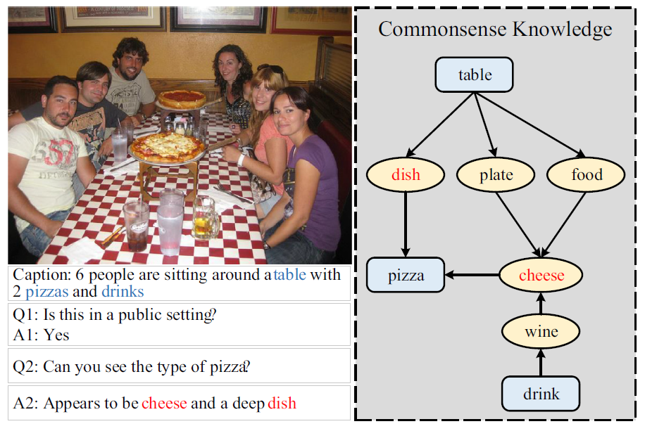
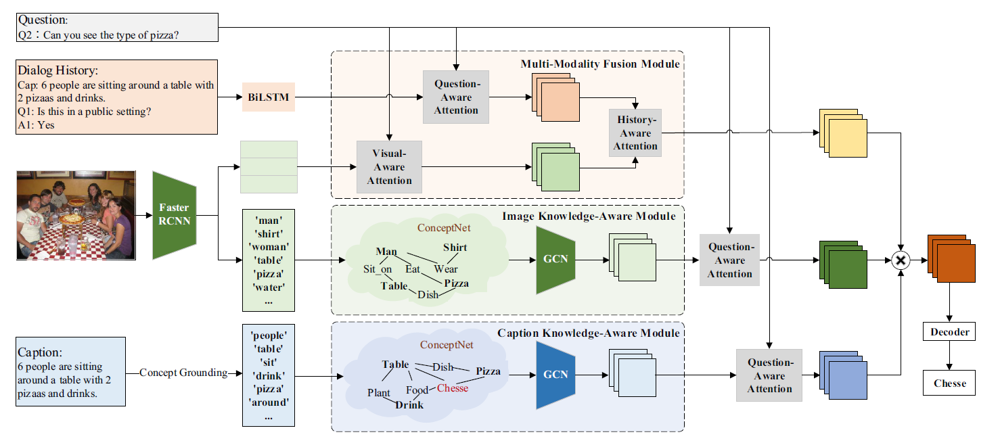
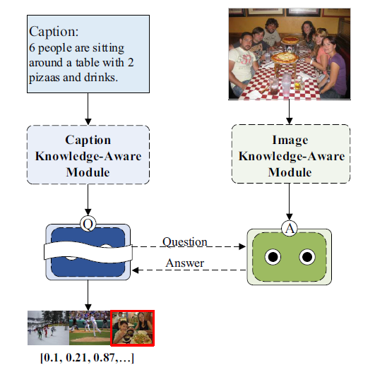

# You should know more：learning external knowledge for visual dialog

## 为什么多模态越来越多关注

+ 合久必分，分久必合
  1. 数据天生是多模态的
  2. 研究领域逐步出现了细化
  3. 随着AGI技术的发展，多模态模型呼之欲出
+ 单模态数据逐渐饱和
  1. 例如，GPT: web-scale text data（边际效应）
  2. 不同模态之间互通有无
+ 模型层面的飞速发展
  1. Transformer(Almost) Rules All
  2. 建模大一统
+ 盘子足够大
  1. 多领域共同推进
  2. 增量市场：新应用、新研究问题

## 融合策略

### 模型无关的融合策略

+ 前融合：**特征融合**，指在模型的浅层或输入层将多个模态的特征拼接起来
+ 后融合：**决策融合**，独立训练多个模型，在预测层（最后一层）进行融合
+ 混合融合：同时结合**前融合**和**后融合**，以及在模型中间层进行特征交互

### 基于模型的融合策略

+ 多核学习：**SVM的扩展**，在处理多个输入时，多核处理多个模态特征，使得每个模态都找到其最佳核函数

+ 基于概率图模型：**隐马尔科夫模型**/**贝叶斯网络建模数据的联合概率分布**（生成式）/**条件概率**（判别式）

+ 基于神经网络：**LSTM**/**卷积层**/**注意力层**/**门机制**/**双线性融合**

## 逻辑链路

通过外部知识进行图片问答

Visual dialog

+ image
+ caption
+ dialog histories
+ commonsense priors
+ logical reasoning

进行常识先验的逻辑推理

## 任务

### 传统视觉对话

+ 通过历史对话、图片和标题，进行答案的推断
+ 历史对话：注意力机制

+ 图片部分：使用Faster RCNN进行转换与编码
+ 标题部分：概念定位
+ 外部知识：三元组形式关联
+ 融合：将三个模态集成到一个多模块的表示输出

### Goal-oriented image guessing

#### 整体结构

#### 策略网络

Q-bot:

+ 只能看到标题
+ 问题解码
+ 问答对编码
+ 历史编码

+ Feature regression network

A-bot:

+ 可以看到图像
+ 问题编码
+ 历史编码
+ 回答解码
+ QA对编码

## 数据集

VisDial v0.9

VisDial v1.0

[数据集详情](https://visualdialog.org/data)