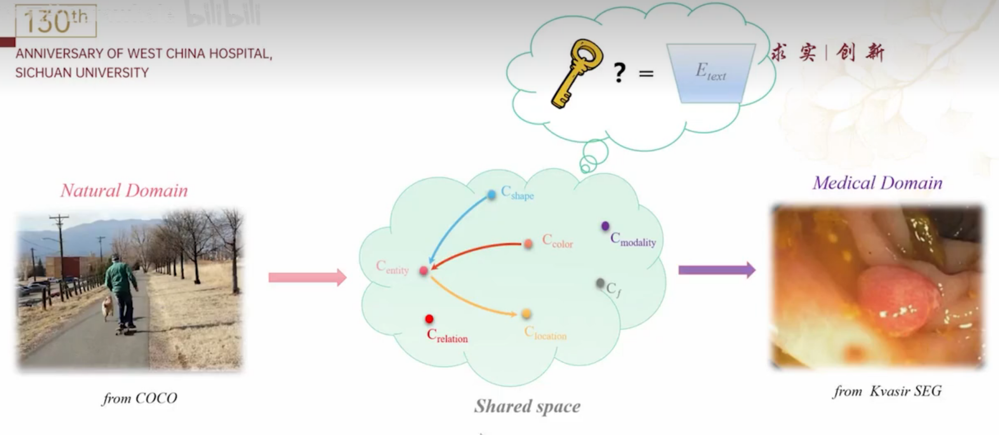
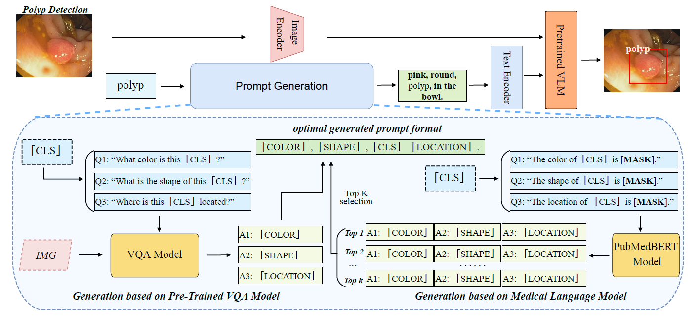
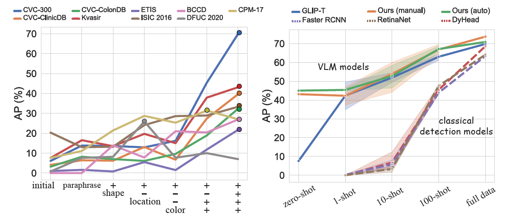
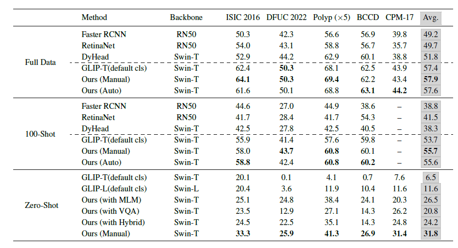
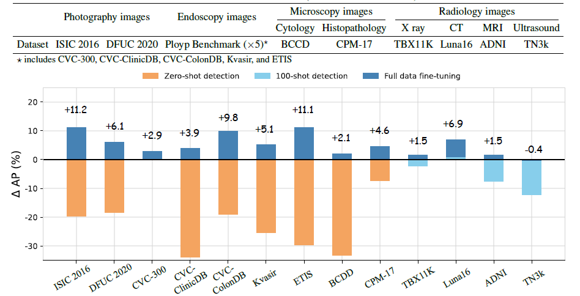
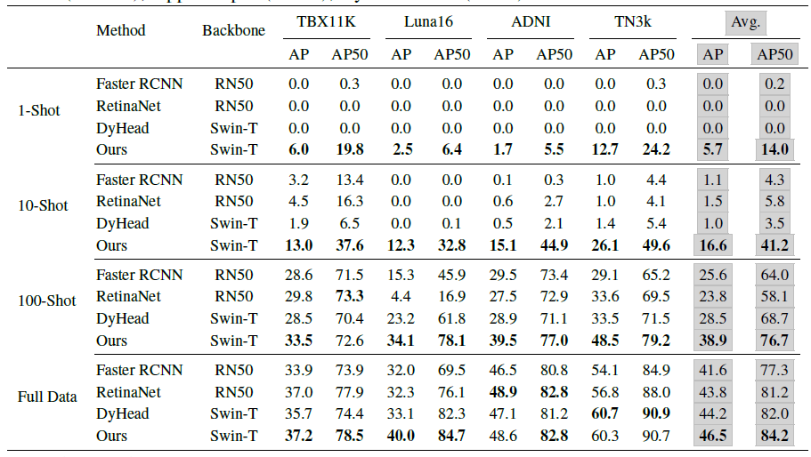

# Medical Image Understanding with Pretrained Vision Language Models: A Comprehensive Study

Github链接：[MIU-VL](https://github.com/MembrAI/MIU-VL)

论文链接：[Medical Image Understanding with Pretrained Vision Language Models: A Comprehensive Study](Medical Image Understanding with Pretrained Vision Language Models A Comprehensive Study.pdf)

## 问题介绍

motivation: medical AI公开数据集过少

+ 病种罕见
+ 涉及隐私，收集难度大
+ 私有数据集不公开

域之间的关系

Medical Domain和Natural Domain是存在交集的，即Medical Domain和Natural Domain之间有部分知识是可以共用的，之前的工作也有很多的应用，比如迁移学习（实际上比直接train from scratch效果更好）等。

## 论文介绍

### 整体思路

使用语言而非纯图像做align

### Template设置

+ 设定一个提示模板-“颜色+形状+实体（类别）+位置”，通过手工精心设计的富有表现力的文本提示，实现了自然领域到医学领域的高效知识迁移

+ $$
  \text { Prompt }=\sum_{m} \text { Template }\left(\left\{v^{A t t r_{i}}\right\}, \text { object }_{m}\right), \text { Attr }_{i} \in\left\{\text { Attr }_{1}, A t t r_{2}, \ldots, \text { Attr }_{N}\right\}
  $$

### 结果

+ 随着特征变多，AP增量显著
+ 进一步，避免耗时耗力的手工设计，提出了三种自动化生成提示的方式，包括MLM、VQA、Hybrid

表现较好，且不同模型之间泛用性较强，跟数据集与shared space之间的domain gap大小有关

在多种模式的13个数据集上进行了大量的实验，验证了方法的有效性

在few-shot上起步效果较好，增加较快

## Rebuttal建议

1. 文章投稿：实力+运气
2. Rebuttal一定不要放弃，特别是对于borderline的文章
3. [建议参考]()

