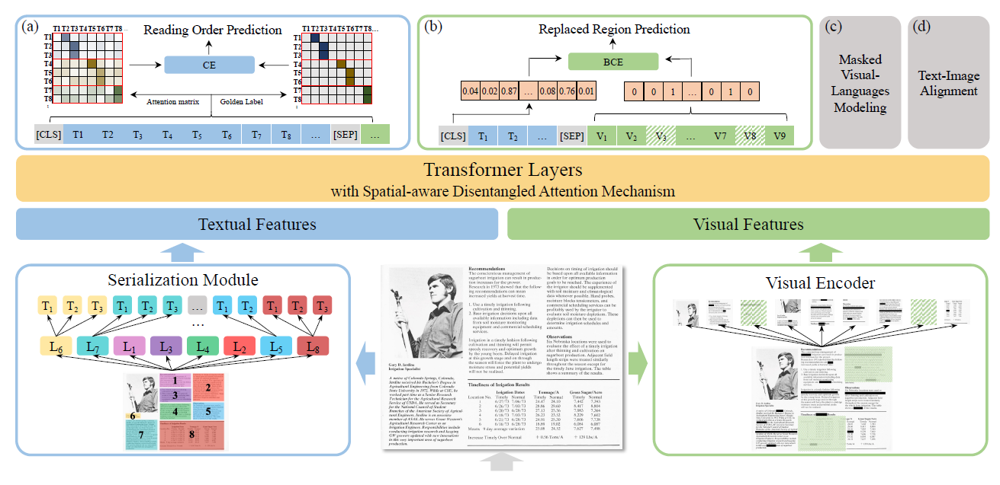
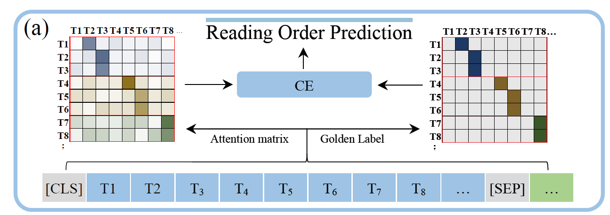
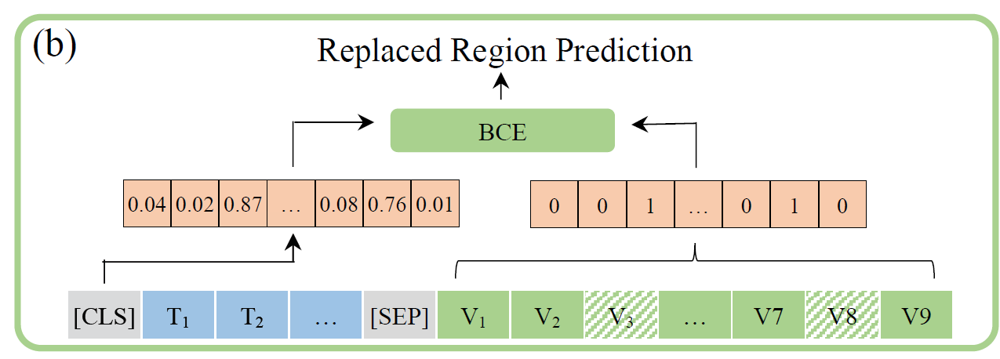

# ERNIE-Layout: Layout Knowledge Enhanced Pre-training for Visually-rich Document Understanding

## 简介与目标

Github链接：[ERNIE-Layout](https://github.com/PaddlePaddle/PaddleNLP/tree/develop/model_zoo/ernie-layout)

论文链接：[ERNIE-Layout: Layout Knowledge Enhanced Pre-training for Visually-rich Document Understanding](ERNIE Layout Layout Knowledge Enhanced Pre-training for Visually rich Document Understanding.pdf)

ErnieLayout是跨模态文档大模型，其目的是提取文档中无结构或半结构化的知识

## 训练数据

预训练数据

|   **数据集**   | **规模** | **语言** |                         **下载链接**                         |
| :------------: | :------: | :------: | :----------------------------------------------------------: |
|    IIT-CDIP    |   4.7G   |   英文   | [IIT-CDIP](https://data.nist.gov/pdr/lps/ark:/88434/mds2-2531) |
| 百度文库数据集 |    -     |   中文   |                              -                               |

微调数据（主要为票据数据集）

|  **数据集**  | **规模** | **语言** |                         **下载链接**                         |
| :----------: | :------: | :------: | :----------------------------------------------------------: |
|    FUNSD     |  16.1M   |   英文   |       [FUNSD](https://guillaumejaume.github.io/FUNSD/)       |
|     CORD     |  1.91G   |   英文   |           [CORD](https://github.com/clovaai/cord)            |
|    SROIE     |  1.02G   |   英文   |      [SROIE](https://paperswithcode.com/dataset/sroie)       |
| Kleister-NDA |   36G    |   英文   | [Kleister-NDA](https://paperswithcode.com/dataset/kleister-nda) |

## 模型结构

文档级跨模态模型

+ 布局信息（Layout features)
  + 输入图像通过DocParser(OCR工具)解析出文本T跟文本布局信息L
  + 文档布局信息$L$
  + 文档分成不同的区域，而不是从左右到从上到下的顺序
    + Paper with Complex Layouts
    + Magazine Scans & Websites
    + Historical Documents
+ 文本信息（文本$T$和布局信息$L$通过Embedding层后拼接在一起）
  + 跟BERT保持一致，文本$T$经过tokenzier跟Embedding后得到`(input embeddings, position_embeddings, token_type_embeddings)`
  + 布局信息$L$是OCR过后，每个bounding box，坐标为$(x_0,x_1,y_0,y_1,h,w)$
  + $(x_0,y_0)$为bounding box的左上角坐标
  + $(x_1,y_1)$为bounding box的右下角坐标
  + $h=y_1-y_0$, $w=x_1-x_0$
  + $x$, $y$, $h$, $w$经过embedding层得到位置向量
+ 图像信息
  + `resize`成224*224
  + 通过Faster R-CNN分割成7*7的feature
  + Feature通过Embedding层得到$V$
  + 同文本一样加入`position_embeddings`, `token_type_embeddings`与bounding box
  + 把Textual features、Layout features与Visual features拼接在一起输入到Transformer Encoder中

## 预训练任务

+ 阅读顺序预测

  + 文本侧的输出层使用一个PointerNetwork来完成下一个词位置的预测

  + 

+ 替换区域预测

  + 随机选择10%的图块，并用另一张图像中的图块替换，预测哪些图块是被替换的

  + 

+ 多模态掩码预测
  + 和普通的MLM一样，mask掉一些token，并预测被mask的token。不同之处在于不mask掉layout信息
+ 涂抹文本预测
  + 随机挑选一行text并cover住其对应的图片位置，预测token对应的图片是否被cover
