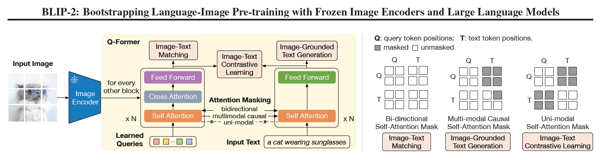
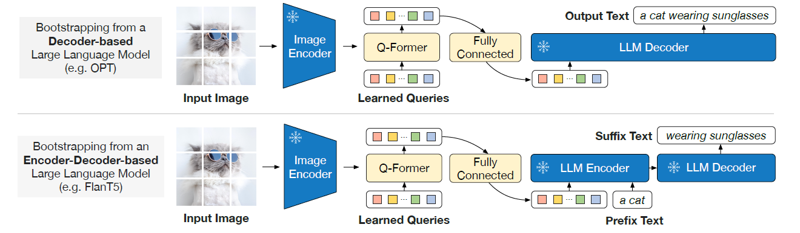

# BLIP-2: Bootstrapping Language-Image Pre-training with Frozen Image Encoders and Large Language Models

## 简介

GitHub链接：[BLIP-2](https://github.com/salesforce/LAVIS/tree/main/projects/blip2)

论文链接：[BLIP-2: Bootstrapping Language-Image Pre-training with Frozen Image Encoders and Large Language Models](BLIP 2 Bootstrapping Language Image Pre training.pdf)

利用现有的image encoder，language model（单模态捕捉能力 => 多模态对齐）

## 模型结构

轻量级query transformer结构如下

1. 冻住image encoder，学习visual language表征
   + 输入：视觉端图像，语言端文本
   + Q-Former进行表征对齐
2. 对齐之后，进行生成（如image captioning, VQA, etc.)
   + 利用LLM训练生成式任务
   + 涌现能力(instruction learning)

## 训练

### 一阶段

目标如下

+ Image-Text Matching（配对）
+ Image-Text Contrastive Learning（参考CLIP）
+ Image-Grounded Text Generation（共享参数 => 产生图文联系和交互）

处理

+ 视觉端：感知图像存在的区域 => learned queries
+ 文本段：attention+feed forward

与LLM相比：结构简单，参数量小

### 二阶段

生成式任务，左侧freeze，添加FC层（不同模块的对齐）

模型：

+ Decoder模型
+ Encoder-Decoder模型

## 实验

+ 主要测试VQA、Image-Captioning、Image-Text Retrieval

+ 数据与BLIP保持一致（较大、含有噪声）

+ 成本低：16-A100(40G) 9 days

+ zero-shot能力强

## 限制

+ 不具有非常强的上下文理解能力(数据集关系单一，image-text pair做训练)
+ LLM的一些风险

