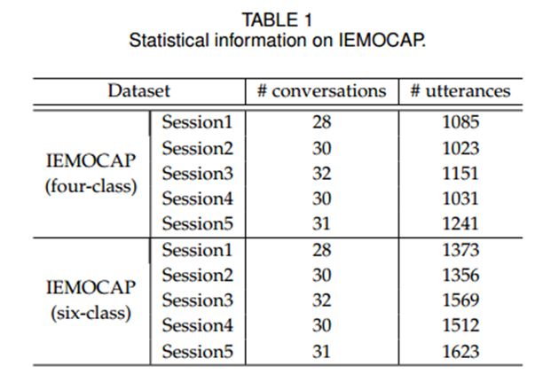
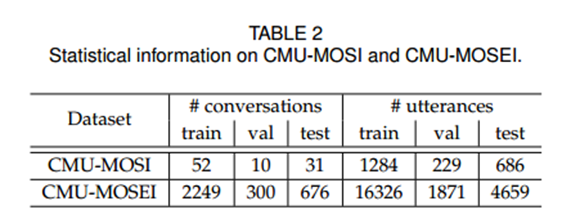
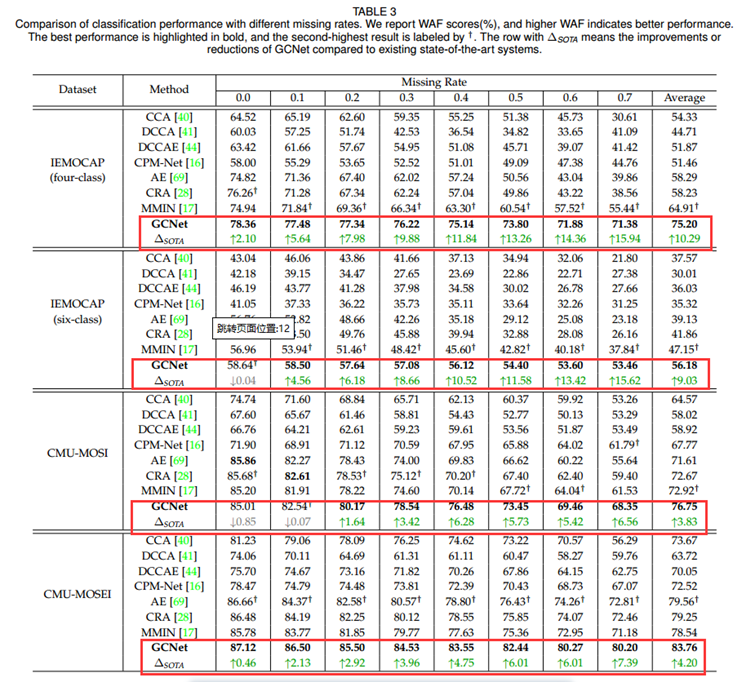

# 1. 背景
人机对话：任务型、问答和闲聊

任务型对话系统：
在人机对话中，任务型对话系统扮演着重要角色，包括任务型、问答和闲聊等。这类系统涉及以下关键步骤：

- **语言理解（Natural Language Understanding）**：解析用户输入，提取其中的语义和语用信息。
- **对话状态跟踪（Dialogue State Tracking）**：追踪用户意图和相关的槽位信息，以维护对话状态。
- **回复决策（Policy Modeling）**：基于对话状态跟踪的结果，决策当前的回复策略。
- **语言生成（Natural Language Generation）**：根据决策的策略输出，生成自然语言回复句子。

这些方法在诸如对话系统和推荐系统等领域得到了广泛应用。为了更全面地理解对话，研究者从不同角度（如情感和内容）收集了大量对话数据，尤其是从社交媒体平台获取数据。然而，不完整的模态数据给对话理解带来了挑战。

现有方法主要针对个别发言或医学图像，而非对话数据。例如，Pham等将涉及情感不完整的发言作为输入。在医学领域，Suo等通过联合优化图像插值和度量学习来从不完整的医学图像中诊断阿尔茨海默病。Liu等则通过将完整数据中的知识应用于不完整数据，以预测缺失部分。

然而，这些方法通常难以充分应用于对话数据。

# 2. 动机
如何解决对话理解中的不完整模态问题？

现有方法主要针对个别话语，而忽略了对话数据中的时间和说话者信息。

本文旨在提出一种新的解决不完整多模态问题的对话学习框架，称为“Graph Complete Network (GCNet)”。该框架旨在充分利用对话中的时间和说话者信息来处理不完整模态数据。

# 3. 方法
为了模拟现实世界中的模态缺失，该方法引入了随机丢弃多模态特征。

为了捕捉对话中的说话者和时间依赖关系，作者提出了两个基于图神经网络的模块：**“Speaker GNN (SGNN)”** 和 **“Temporal GNN (TGNN)”**。这两个模块共享相同的图结构，但使用不同的边类型。

分类和重构任务以端到端的方式共同优化。

# 4. 实验
## 4.1 数据集

## 4.2 对比模型
本部分介绍了几个对比模型：
- **CCA** 是强大的基准模型。它侧重于不同模态之间的线性组合。
- **DCCA** 是对CCA的扩展。它同样关注于不同模态之间的线性组合。
- **DCCAE** 是基于CCA的另一扩展。它使用自动编码器学习每个模态的隐藏特征，然后优化自动编码器的重构误差和规范相关性。
- **AE** 在不完整多模态学习中得到广泛应用。
- **CRA** 是AE的扩展。它将一系列残差自动编码器组合成级联架构，用于数据插补。
- **MMIN** 是另一种AE的扩展。它将CRA与循环一致性学习相结合，以预测缺失模态的潜在表示。
- **CPM-Net** 同时考虑完整性和结构，用于学习判别性潜在表示。

## 4.3 实验结果

# 5. 总结
本文提出了GCNet框架，用于处理对话数据中的不完整多模态问题。具体地：
- 在不同缺失率下，验证了GCNet始终优于先进方法，实现了最佳分类和插补性能。
- 强调了不完整数据在特征学习中的重要性，并证明了GCNet各组成部分的必要性。
- 可视化参数调整过程，揭示了不同超参数的影响。通过收敛分析，证明了分类和插补之间的相关性。当GCNet能够很好地重构完整模态数据时，可以实现较好的分类性能。

未来，将扩展该方法的应用。除了对话情感识别，还将在其他会话理解任务中利用GCNet处理不完整模态问题。此外，将探索基于话语之间相关性的动态边构建策略，以超越固定上下文窗口大小的限制。

# 6. 视频
[链接](https://www.bilibili.com/video/BV1nx4y1o71C/?spm_id_from=333.999.0.0&vd_source=ea360fd756fe9f1eb6a41d27bf00a476)
