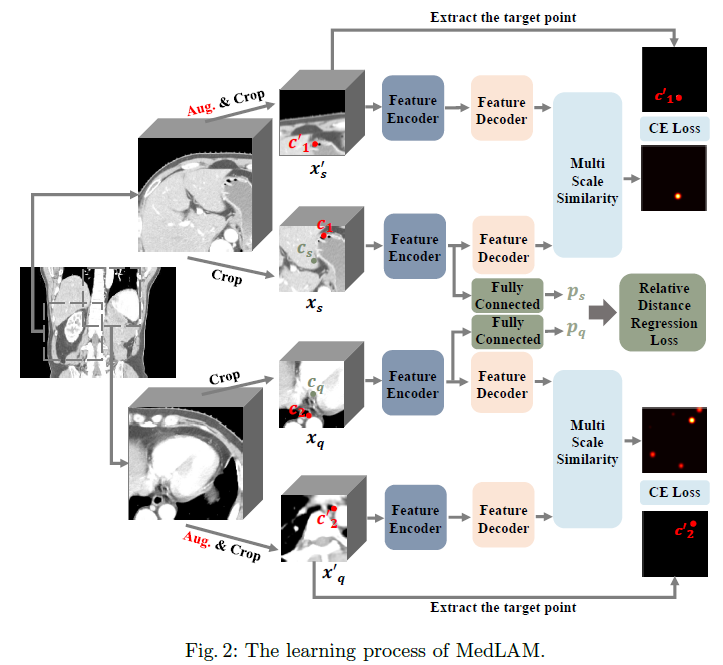
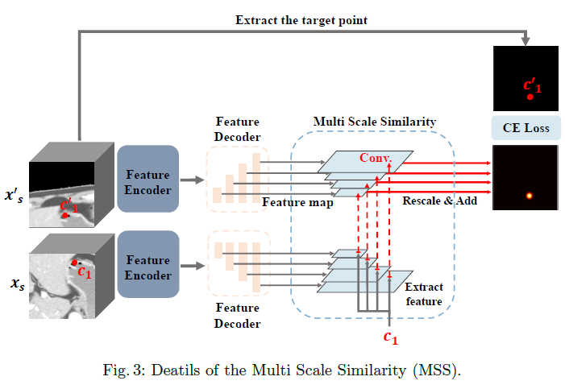
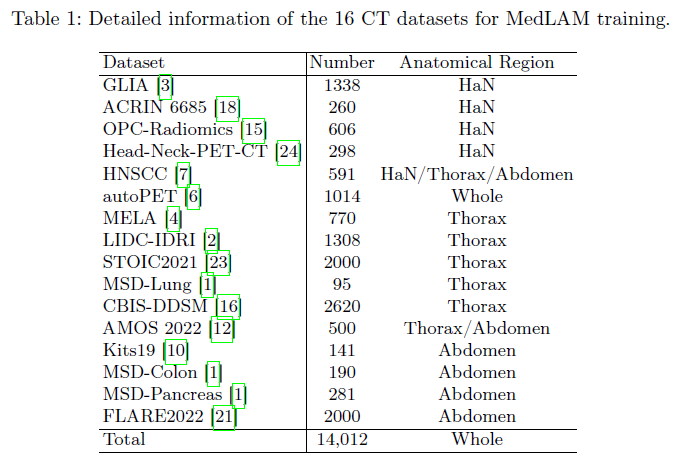
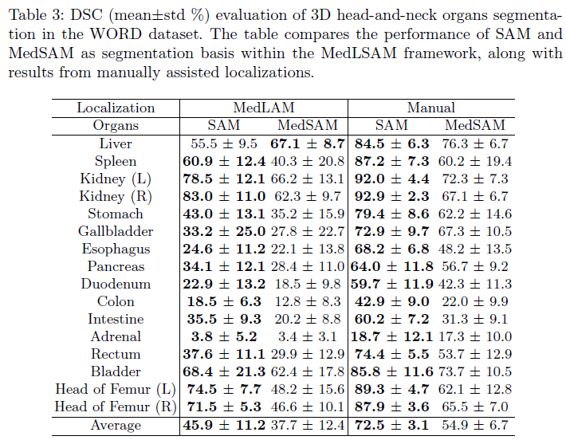

# 1. 背景
近年来，图像分割领域的Segment Anything Model (SAM)模型在分割任务中取得了突破性的成果。然而，原始的SAM模型及其医学应用都需要逐层标注，这直接增加了数据集的标注工作量。因此，本研究旨在解决这个问题，提出了MedLSAM模型，通过few-shot定位框架实现对任何目标解剖部位的定位，从而简化了标注过程。
# 2. 动机
本研究的动机是解决SAM模型在医学图像分割中的标注问题，通过引入few-shot定位框架和结合SAM模型，实现了对3D医学图像中任何目标解剖部位的定位和分割，从而简化了标注过程。
# 3. 方法

本文介绍了MedLSAM，一种自动化的医学图像分割模型，可以减少标注工作量。它利用了一种称为MedLAM的少样本定位框架，在体积医学图像中自动识别目标器官。定位过程为目标器官生成3D边界框，然后由Segment Anything Model (SAM)用于精确的图像分割。MedLSAM消除了分割过程中的手动干预的需求。

MedLAM的训练包括两个主要组成部分：
- 相对距离回归（RDR）: RDR将来自不同个体的3D扫描图像映射到统一的隐式3D解剖坐标系统中，允许在查询扫描中对目标点进行初始定位。
- 多尺度相似性（MSS）: MSS利用特征编码和解码来通过识别最相似的特征来改进初始定位点附近的定位精度。
# 4. 实验
## 4.1 数据集

## 4.2 实验结果

- MedLAM的定位性能使用交并比（IOU）指标进行评估。在WORD数据集中，该模型在Head of Femur (L)器官上达到了最高IOU为0.737的出色定位效果。然而，胆囊器官的IOU最低为0.180，表明在定位较小器官方面存在挑战。

- 在StructSeg Task1数据集中，MedLAM在小器官（如左右眼）的定位上表现出与手动定位相当的性能，DSC值约为61-67%。然而，对于像左右晶状体这样的微小器官，MedLAM与手动定位的DSC值相似，SAM为22%，MedSAM为16%。另一方面，对于下颌骨（左右）的定位，MedLAM的性能较低，SAM的DSC值为48.3%，MedSAM的DSC值仅为9.0%和2.6%，而手动定位的DSC值分别为85.3%和80.4%。

- 在WORD数据集中，对于腹部器官分割，MedLAM在左右肾等器官上表现出稳健的性能。与SAM结合后，左肾的DSC达到78.5%，右肾为83.0%。与MedSAM结合后，模型在左肾上保持了令人满意的性能，DSC为66.2%，右肾为62.3%。然而，对于肾上腺等较小的器官，SAM和MedSAM的DSC值都低于4%，而手动定位的DSC值为18.7%。

- MedLSAM在涵盖38个不同器官的两个3D数据集上展示了其多功能性的强大性能。这种自动化方法在数据规模增加时不会增加标注工作量。它还有望与未来潜在的医学领域3D SAM模型直接集成，进一步提高性能和实用性。
# 5. 总结
本研究提出了MedLSAM模型，通过引入few-shot定位框架和结合SAM模型，实现了对3D医学图像中任何目标解剖部位的定位和分割，从而简化了标注过程，并在两个3D数据集上进行了实验证明其性能。

[comment]: <> (# 6. 视频)

[comment]: <> ( [链接]&#40;TODO&#41;)
