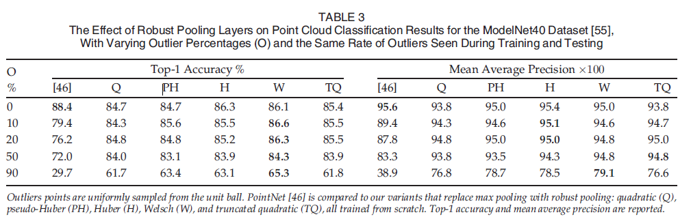

# 1. 背景
现代深度学习模型由参数化的处理节点组成，通过显式定义的前向函数将输入数据转换为输出。本文提出了一种新的深度学习模型，通过隐式定义数学优化问题的解作为数据处理节点的前向函数，实现了端到端的可学习模型。
# 2. 动机
本文的研究动机是探索一种新的深度学习模型，通过隐式定义数学优化问题的解作为数据处理节点的前向函数，实现端到端的可学习模型。这种声明式的定义方式可以克服传统深度学习模型的一些限制，并提供更灵活和可解释的模型。通过实验验证，作者展示了深度声明网络在图像和点云分类任务中的应用潜力。
# 3. 方法
本文讨论了深度声明网络（DDNs）的概念及其在解决深度学习模型中的优化问题中的应用。
先前的研究已经探索了在深度学习模型中特定优化问题的微分，例如无约束、线性约束和不等式约束问题。
本文将这些结果扩展到包括具有非线性等式和不等式约束的问题的微分。
还讨论了通过二次规划（QP）和锥规划进行微分，这些凸问题的最小值可以使用高效的算法找到。
文中提到了使用纪律凸规划框架自动化凸规划中的微分。
通过线性规划（LP）进行微分更具挑战性，最近的研究已经探索了随机平滑作为一种解决方法。
文中还讨论了通过离散子模问题进行微分，其中导数可以通过最小化问题的凸松弛来计算。
还提到了通过半定规划（SDPs）进行微分以解决MAXSAT问题，通过深度平衡模型进行微分，以及使用伴随敏感度方法通过常微分方程（ODE）初值问题进行微分。
文中还提到了基于优化问题的可微组件，用于特定任务，如视频分类、视觉属性排序、少样本学习、相机姿态估计和模型预测控制。
还讨论了用于物理模拟和对深度神经网络施加硬约束的可微模型。

# 4. 实验
## 4.1 数据集
本文使用ModelNet40 CAD数据集，每个对象采样2048个点，归一化为一个单位球。

## 4.2 实验结果

# 5. 总结
本文提出了一种新的深度学习模型，称为深度声明网络（Deep Declarative Networks），通过隐式定义数学优化问题的解作为数据处理节点的前向函数，实现了端到端的可学习模型。通过隐式函数定理，可以通过这些声明式定义的节点进行反向传播，从而实现端到端的学习。作者还提供了在流行的PyTorch深度学习软件库中实现声明式和命令式节点的方法，并通过图像和点云分类任务的实验验证了这些声明式节点的应用。

[comment]: <> (# 6. 视频)

[comment]: <> ( [链接]&#40;TODO&#41;)
